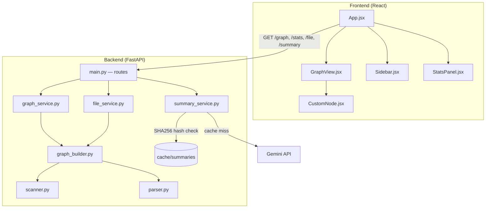

# RepoAnalyser
 
A tool that scans a local Git repository, maps out how its files depend on each other, and renders the whole thing as an interactive, draggable graph with AI-generated summaries on click.
 
No more guessing where to start in an unfamiliar codebase. Point it at a folder, see the architecture.
 
---
 
## What it actually does
 
1. Walks a local directory and finds every Python, JavaScript, TypeScript, C, and C++ file.
2. Parses each file (without executing it) to figure out what it imports and how many lines it has.
3. Builds a dependency graph — nodes are files, edges are import relationships.
4. Serves that graph as JSON over a REST API.
5. The frontend renders it on an infinite canvas using React Flow, where you can drag nodes, zoom, search, and inspect files.
6. Click any file and an AI (Gemini 2.5 Flash) generates a plain-English summary of what it does — cached so you're not burning API calls re-summarizing the same file twice.
 
---
 
## Tech Stack
 
| Layer | Stack |
|---|---|
| Backend | Python 3.12, FastAPI |
| Dependency parsing | `ast` (Python), regex (JS/TS/C/C++) |
| AI | Google Gemini 2.5 Flash |
| Frontend | React (Vite), React Flow, Axios |
| Layout | Dagre (auto-arranges the graph) |
 
---

## Working Demo

[Screencast_20260630_134419.webm](https://github.com/user-attachments/assets/62094cba-b64a-4146-9659-72bf4c8af647)

 
## Architecture
 
The backend is layered, routes never touch the filesystem directly, everything goes through a service.
 

 
**Flow:** `Routes → Services → Analyzer → Filesystem`. The analyzer layer is where the actual file-walking, parsing, and graph-building logic lives. Services orchestrate and cache. Routes stay thin.
 
---
 
## Features
 
- **Dependency extraction** — Python via AST, JS/TS via import/require regex (resolves relative paths, skips external packages like `react` or `axios`), C/C++ via local `#include`.
- **Interactive graph** — drag, zoom, pan, minimap, auto-layout via Dagre, language-colored nodes.
- **Search** — type a filename, matching nodes light up and the viewport centers on your pick.
- **File inspector** — click a node to see path, LOC, imports, "imported by," and full syntax-highlighted source.
- **AI summaries** — Gemini explains a file's purpose, responsibilities, and key functions in Markdown, rendered in the sidebar.
- **Smart caching** — summaries are keyed by `SHA256(file contents)`. Same file, same hash, same cached result — no wasted API calls. Edit the file and the hash changes, triggering a fresh summary.
- **Repo stats** — total files, total LOC, language breakdown, largest files at a glance.
- **PNG export** — save the current graph view as an image.
 
---
 
## Setup
 
### Backend
 
```bash
# from the repo root
mkdir -p backend/cache/summaries
 
# create backend/.env and add your Gemini key
echo "GEMINI_API_KEY=your_key_here" > backend/.env
```
 
> Get a free key from [aistudio.google.com](https://aistudio.google.com/app/apikey). Without this, the graph and file inspector still work — only the AI summary feature needs it.
 
Install and run:
 
```bash
uv run uvicorn backend.main:app --reload
```
 
API will be live at `http://127.0.0.1:8000`.
 
### Frontend
 
```bash
cd frontend
npm install
npm run dev
```
 
App will be live at `http://localhost:5173`.
 
---
 
## API Reference
 
| Endpoint | Description |
|---|---|
| `GET /graph?path=.` | Returns nodes + edges for the given repo path |
| `GET /stats?path=.` | Returns file count, LOC, language breakdown, largest files |
| `GET /file?path=...&repo_path=.` | Returns content, LOC, imports, and reverse-dependencies for a single file |
| `GET /summary?path=...` | Returns (or generates + caches) an AI summary for a file |
 
---
 
## Project Structure
 
```
backend/
├── analyzer/        # scanning, parsing, graph building — the actual logic
├── services/         # orchestration + caching layer between routes and analyzer
├── utils/             # shared helpers (e.g. module name resolution)
├── cache/summaries/   # AI summary cache, keyed by content hash
└── main.py           # FastAPI routes (thin, no business logic)
 
frontend/
└── src/
    ├── components/    # GraphView, Sidebar, StatsPanel, CustomNode
    ├── services/      # api.js — axios client
    └── utils/         # layout.js — Dagre auto-layout
```
 
---
 
## Notes
 
- The backend architecture is intentionally layered and is treated as stable — extend services rather than bypassing them.
- External package imports (e.g. `react`, `axios`, `fastapi`) are intentionally excluded from the graph; only intra-repo file relationships are shown.
- `.git`, `node_modules`, `__pycache__`, and `.venv` are ignored during scanning.
